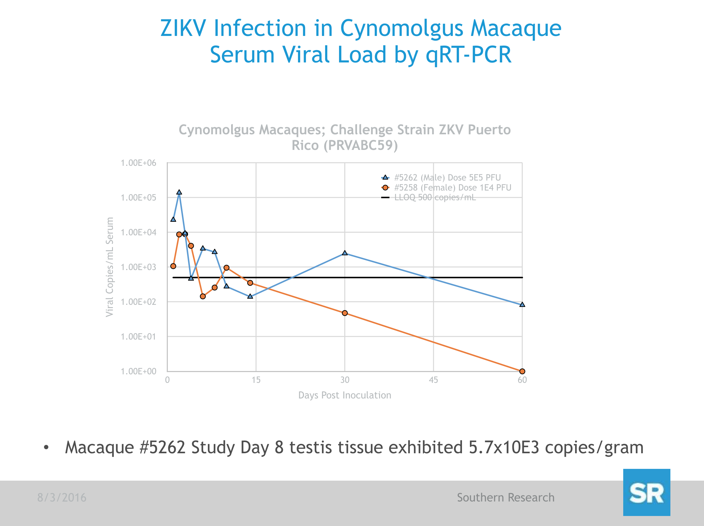
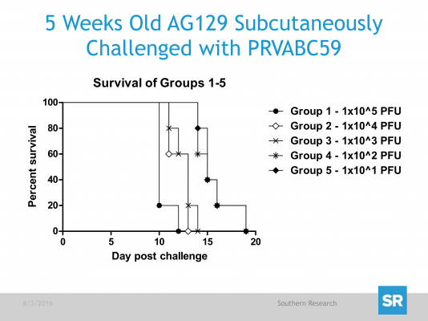

  

      <ul class="nav">
          <li><a href="https://bit.ly/SR-Zika">data release updates</a></li>
          <li><a href="https://github.com/Southern-Research">github</a></li>
          <li><a href="http://www.southernresearch.org/zika-virus/">blog</a></li>
          <li><a href="https://twitter.com/SoResearchNews">@SoResearchNews</a></li>
      </ul>
  

<table class="wide">
<tr>
  <td class="left">
    
  </td>
  <td class="right">
    
  </td>
</tr>

</table>

  

      <ul class="nav">
          <li><a href="{{ BASE_PATH }}/assets/rhesus_020417.pdf">Rhesus Macaque Model (Raw Data)</a></li>
          <li><a href="{{ BASE_PATH }}/assets/Development-of-a-Zika-Virus-Infection.pdf">Koide, et al. (2016) Development of a Zika Virus Infection Model in Cynomolgus Macaques. Front. Microbiol. 7:2028.</a></li>
      </ul>
  

